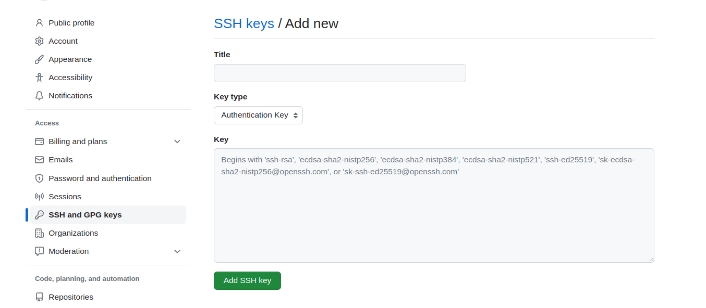
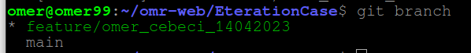
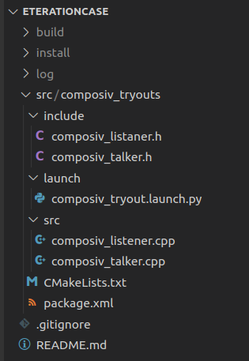
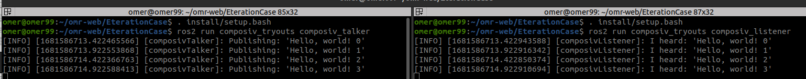
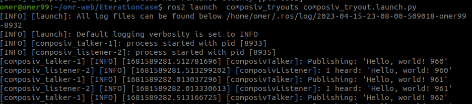
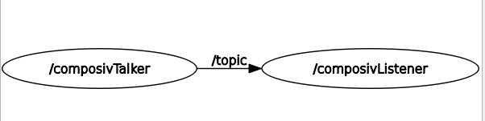
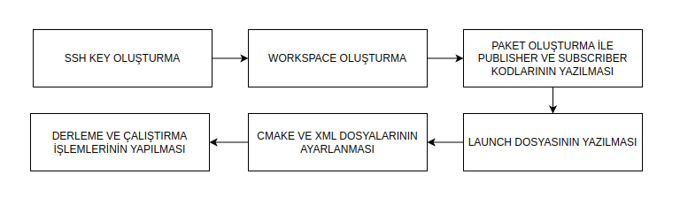

# ETERATION/CASE

Bu repo ROS2 platformunda C++ programlama dili kullanılarak publisher ve subscriber örneklerinin nasıl yazılması gerektiğini içerir.

Kullanılan yazılım ve donanım özellikleri:

Ubuntu 22.04 

ROS2 Humble Distro.

# CHECKPOINT-1

### SSH Key Oluşturma

 kullanılan linux işletim sistemli bilgisayarda öncelikle git işlemlerinin kolay yapılabilmesi için “ssh key” oluşturulması gerekmektedir:

** home dizini altında “ mkdir EterationCase “ komutu ile ilgili klasör oluşturulur ve “ cd EterationCase” komutu ile klasöre giriş yapılır. Daha sonra aşağıdaki adımlarla ssh key oluşturma işlemi gerçekleştirilir:

```bash
 ssh-keygen 
```

komut yazıldıktan sonra gelen sorulara enter tuşuna basarak cevap verilebilir. Daha sonra ssh key’in olduğu klasöre gitmek için aşağıdaki komut çalıştırılır.

```bash
cd ~./ssh
ls
```

bu dizin altında id-rsa ve id-rsd.pub adında iki adet dosya bulunmaktadır. id-rsa şifreyi id-rsa.pub ise kullanıcı adını içerisinde bulundurur. Cat komutu kullanılarak ssh key kopyalanır.

```bash
cat id-rsd.pub
```

ssh-key github da ayarlar sekmesinde ssh key ekleme bölümüne eklenir.



**Figür-1**

Son adım olarak repo nun ssh linki kopyalanır ve istenilen dizine clone’lama işlemi aşağıdaki komut ile gerçekleştirilir.

```bash
git clone [git@github.com](mailto:git@github.com):omr-web/EterationCase.git
```

### Yeni Branch Oluşturma ve Kontrol Etme

```bash
git checkout -b feature/omer_cebeci_14042023
git branch
```



**Figür-2**

### Paket Oluşturma:

```bash
mkdir src
cd src
ros2 pkg create --build-type ament_cmake composiv_tryouts
```

Derleme türü, ROS2’nin kullandığı, ament_cmake olarak seçilmiştir.

# CHECKPOINT-3-5-6-7

### Paket İçinde Bulunacak Klasör ve Dosyaların Oluşturulması:

```bash
cd composiv_tryouts
mkdir include src launch
cd include 
touch composiv_listener.h
touch composiv_talker.h
cd ..
cd src
touch composiv_listener.cpp
touch composiv_talker.cpp
cd ..
cd launch 
touch composiv_tryout.launch.py
```

*Kodların içeriği repo da bulunduğu için readme dosyasına eklenmemiştir.

### Cmake ve xml Dosyalarının Düzenlenmesi

```jsx
cmake_minimum_required(VERSION 3.8)
project(composiv_tryouts)

if(CMAKE_COMPILER_IS_GNUCXX OR CMAKE_CXX_COMPILER_ID MATCHES "Clang")
  add_compile_options(-Wall -Wextra -Wpedantic)
endif()

include_directories( 
                      include   
                    )
# find dependencies
find_package(ament_cmake REQUIRED)
find_package(rclcpp REQUIRED)
find_package(std_msgs REQUIRED)

add_executable(composiv_talker src/composiv_talker.cpp)
ament_target_dependencies(composiv_talker rclcpp std_msgs)

add_executable(composiv_listener src/composiv_listener.cpp)
ament_target_dependencies(composiv_listener rclcpp std_msgs)

install(TARGETS
  composiv_talker
  composiv_listener
  DESTINATION lib/${PROJECT_NAME})

install(
    DIRECTORY launch   
    DESTINATION share/${PROJECT_NAME}) 

ament_package()
```

Python programlama dili yorumlanan bir dil iken C ve C++ dilleri derlenen dillerdir. Aynı zamanda C ve C++ dillerinde derleme işleminden sonra link leme (bağlama) işlemi de gerçekleştirilir. Makefile’lar bu derleme ve bağlama işlemlerinin nasıl gerçekleşeceğini belirler. Örneğin hangi derleyeci kullanılacak, hangi paketler bağlanacak vb. Fakat her donanımın özellikleri farklı olduğu için Makefile yapısıda farklı olacaktır bu durum programcı için bir zorluk olarak görülebilir. CMake dosyalarının amacı kullanılan donanım ve işletim sistemine göre Makefile dosyalarını oluşturmaktır.  

Cmake dosyasında

- Cmake versiyonu belirtilmiştir.
- Kullanılacak derleyici türü belirtilmiştir.
- Derleme esnasında başlık dosyalarını bulmak için aranacak dizinler belirtilmiştir.
- Kullanılacak paketler belirtilmiştir.
- Çalıştırılabilir dosya haline getirilecek kaynak kodlar belirlenmiş ve gerekli paketler ile linkleme işlemi gerçekleştirilmiştir.
- Çalıştırılabilir dosyaların ve launch dosyasının adresleri run time için belirtilmiştir. (install komutu)

adımları uygulanmıştır.

```xml
<?xml version="1.0"?>
<?xml-model href="http://download.ros.org/schema/package_format3.xsd" schematypens="http://www.w3.org/2001/XMLSchema"?>
<package format="3">
  <name>composiv_tryouts</name>
  <version>0.0.0</version>
  <description>TODO: Package description</description>
  <maintainer email="gtuomer@gmail.com">omer</maintainer>
  <license>TODO: License declaration</license>

  <buildtool_depend>ament_cmake</buildtool_depend>
  
  <depend>rclcpp</depend>
  <depend>std_msgs</depend>
  
  <test_depend>ament_lint_auto</test_depend>
  <test_depend>ament_lint_common</test_depend>

  <export>
    <build_type>ament_cmake</build_type>
  </export>
</package>
```

XML dosyasında 3. parti kütüphane olarak kullanılan bağımlılıklar belirtilmiştir.

Yapılan işlemler sonucunda dosya dizin yapısı Figür-3’te belirtildiği gibi olmalıdır:



**Figür-3**

> paket oluşturma komutu çalıştırıldığında include dizini altında paket ismini taşıyan bir klasör oluşur. Geleneksel kullanım gereği başlık dosyaları bu klasör içinde oluşturulmak yerine direkt include klasörü altında oluşturulur. Paket ismini taşıyan klasör ise silinir.
> 

### Paketin Derlenmesi:

```bash
cd /home/omer/omr-web/EterationCase
colcon build
```

### Paketin Çalıştırılması:

Düğümlerin “run” komutu ile çalıştırılması:

Bu çalıştırma şeklinde iki farklı terminal açılır. 

Bir terminal de publisher çalıştırılırken diğer terminal de ise subscriber düğümleri çalıştırılır. İlk adım olarak çalışma ortamının (workspace) bulunduğu dizine gidilir ve aşağıdaki komutlar her iki terminal için sırasıyla çalıştırılır:

```bash
. install/setup.bash 
ros2 run composiv_tryouts composiv_talker 
```

```bash
. install/setup.bash 
ros2 run composiv_tryouts composiv_listener
```

Yukarıdaki kod bloklarında yazılan komutlar sırasıyla:

ROS2’ye ait bash dosyasını ve belirtilen pakette bulunan executable dosyayı çalıştırır.

```bash
ros2 run paket_adı executable_dosya_adı 
```

Komutlar çalıştırıldığında terminal ekranında görünmesi gereken çıktılar Figür-4’teki gibidir.



**Figür-4**

Düğümlerin Launch Dosyası ile Çalıştırılması:

Paketlerin bulunduğu çalışma ortamının dizinine gidilir ve aşağıdaki komutlar sırasıyla çalıştırırılır.

```bash
. install/setup.bash
ros2 launch  composiv_tryouts composiv_tryout.launch.py
```

Komutlar doğru şekilde çalıştırıldığında ekranda gözlemlenmesi gereken çıktılar Figür-5’teki gibi olmalıdır.



**Figür-5**

ROS2 de oluşturulan topic ve node’lar aşağıdaki komutlar ile listelenebilir

```bash
ros2 topic list 
ros2 node list
```

Aynı zamanda ROS2 kurulumu ile gelen rqt programı sayesinde node ve topic’ler grafiksel olarak da gözlemlenebilir:



Figür-6

# CHECKPOINT-4

Yazılan publisher ve subscriber kodları doğru çalışması subscriber kodunda yazılan callback fonksiyonunun çağrılıp çağrılmadığına bakılarak kontrol edilebilir. Bunun için callback fonksiyonunun içerisine ROS2’nin bilgilendirme için sunmuş olduğu RCLCPP_INFO fonksiyonu kullanılmıştır. Figür-4 ve Figür-5 incelenirse callback fonksiyonunun çalıştığı gözlemlenir. Aynı zamanda rqt kullanılarak Node’ların ve Topic’lerin durumu incelenebilir. Figür-6’ya bakılarak bu durum yorumlanabilir. Aşağıdaki komutlar ile yayınlanan topic in mesaj içeriği, türü ve çalışma frekansı hakkında bilgi alınabilir.

```bash
ros2 topic echo topic
ros2 topic info /topic
ros2 topic hz /topic
```

# CHECKPOINT-9

yazılan bütün kodlar github da bulunan ilgili repo ya aşağıdaki komutlar kullanılarak gönderilir. 

```bash
git add .
git commit -m "publisher_subscriber"
git push origin feature/omer_cebeci_14042023
```

Yukarıda belirtilen işlemler yapılmadan önce aşağıdaki komut ile bulunulan branch kontrol edilebilir.

```bash
git branch
```

Yukarıda gerçekleştirilen işlemler Blokdiyagram-1’de özetlenmiştir.



Blokdiyagram-1

# GENEL BİLGİLER

### ROS2’nin ROS1’e göre avantajları:

- Master-slave kavramı ROS2’de bulunmamaktadır. O yüzden ağdan çıkan bir cihazın olması diğer cihazların çalışmasını etkilemez.
- ROS1 akademik çalışmaların kullanılmasında tercih edilen bir platform durumundadır. Kullanıcıya verilecek son ürün tasarımı için uygun bir platform değildir. Fakat ROS2 tamamiyle piyasa için oluşturulmuş bir yapıya sahiptir.
- ROS2 master olmadan sağladığı bu haberleşme sistemini DDS (Data Distribution Service ) ara katmanı sayesinde gerçekleştirmiştir. DDS veri taban merkezli bir haberleşme sistemidir. (Data-genric). API ve haberleşme semantiği arasında bağlantı kurar bu da aslında data sağlayıcı (publisher) ve data alıcı (subscriber) arasında haberleşmeyi sağlar. DDS kullanıcılara global bir alan sunar. Kullanıcılar bu alana veri yayımlayabilir veya abone olup veriyi alır. Aynı global alana sadece aynı domain ve ağ da bulunan kullanıcılar erişebilir. Ağ üzerinden haberleşmeyi sağlayan protokol RTPS dir. (Real-Time Publish Subscribe). Bu protokol, TCP/UDP/IP gibi aktarımlar üzerinden yayıncı-abone iletişimi sağlar ve farklı DDS uygulamaları arasında uyumluluğu garanti eder. DDS ara katmanı ve haberleşme ağı Figür-7’de verilmiştir [2].

![Figür-7 [2]](Readme/Untitled%201.png)

Figür-7 [2]

DDS domain’i içerisinde bulunan her bir kullanıcı DomainParticipant olarak tanımlanır. Global alana veri yayınlayan DomainParticipant Publisher, veriyi global alandan okuyan DomainParticipant Subcriber olarak adlandırılır. Bir DomainParticipant hem publisher hem de subscriber olabilir.

### ROS Kullanımının Avantajları

- Aynı ağda bulunan iki cihazın DDS ara katmanı sayesinde kesintisiz haberleşebilmesi
- Farklı işlevleri yerine getiren kodların ROS yapısı gereği kolayca farklı paketler halinde yazılması ve bu paketlerin eş zamanlı olarak bir arda çalıştırılabilmesi
- Farklı paketlerin farklı programlama dilleri ile yazılabilmesi
- Bir çok farklı programlar ile kolayca haberleşme sağlayabilmesi MATLAB,GAZEBO vs.

# KAYNAKLAR

[1] ROS2 Humble Documentation

[https://docs.ros.org/en/humble/index.html](https://docs.ros.org/en/humble/index.html)

[2] DDS Middleware 

[https://fast-dds.docs.eprosima.com/en/latest/fastdds/ros2/ros2.html](https://fast-dds.docs.eprosima.com/en/latest/fastdds/ros2/ros2.html)